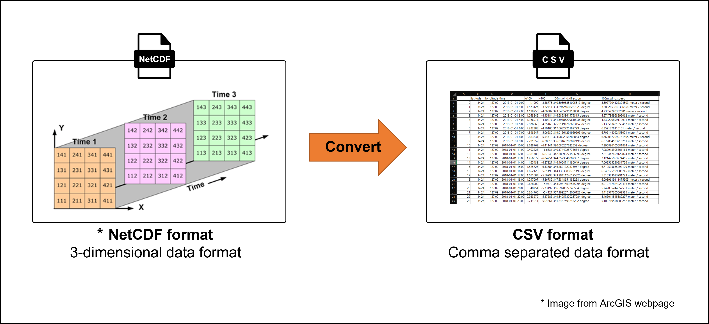

# ERA05_extractor `22 09 28
This repository aims to extract formatted CSV file(.csv) from NetCDF format file(.cdf) downloaded from the Copernicus Data Store.
<p align="center">
  
</p>

### Requirements
- [pandas](https://pandas.pydata.org/docs/getting_started/install.html)
- [numpy](https://numpy.org/install/)
- [netCDF4](https://github.com/Unidata/netcdf4-python)
- [cftime](https://unidata.github.io/cftime/installing.html)
- [notebook](https://jupyter.org/install)
- [pyyaml](https://pypi.org/project/PyYAML/)
- [metpy](https://unidata.github.io/MetPy/latest/userguide/installguide.html)


### Instruction 
1. Install required python libraries with below scripts in project directory.
   ```
   pip install -r requirements.txt
   ```
2. Open with Ipython file `main.ipynb`.

3. Run each cells according to instructions.

### Dataset preparation
You should download needed `netCDF4` files in [the Climate Data Store](https://cds.climate.copernicus.eu/cdsapp#!/dataset/reanalysis-era5-pressure-levels?tab=overview, "Copernicus Data Center link") or other sources.  When you used the Climate Data Store, some data array in `netCDF4` file can have one more dimension if you're downloading the latest date file. However, this code will handle them.

### Contact
If you have any questions, please create issues in this repository or email to official e-mail address. (jone.oh@bluewind-eng.com) 

<p align="center">
  
</p>
